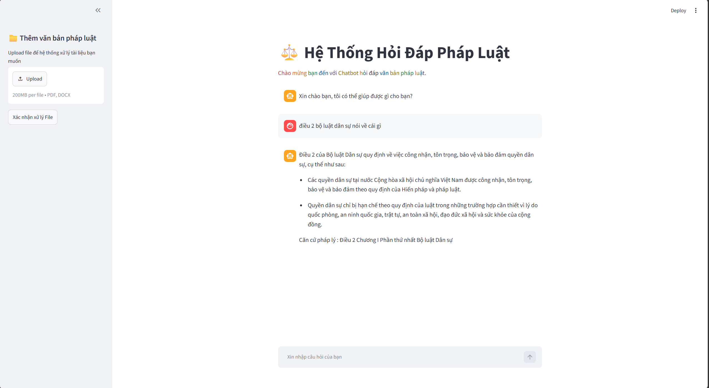
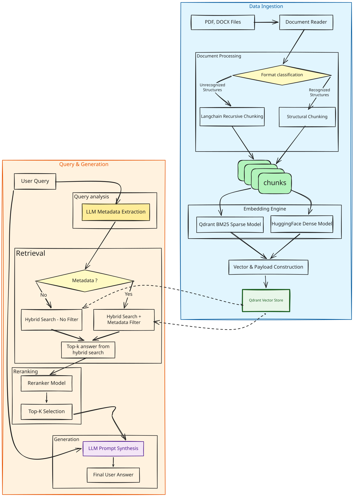

# ⚖️ LawRAG: Vietnamese Legal RAG System

LawRAG is a specialized Retrieval-Augmented Generation (RAG) system designed for Vietnamese legal documents (PDF and DOCX). It utilizes Hybrid Search (Dense + Sparse embeddings) combined with Reranking to maximize retrieval accuracy for legal Articles and Clauses, while eliminating LLM hallucination.



## ✨ Key Features

- **Multi-format Support**: Processes PDF (text-based/selectable only) and DOCX files. 
  Scanned or image-based PDFs are not currently supported (OCR not implemented).
- **Smart Chunking Strategy**:
  - *Structural Chunking*: Regex-based splitting tailored to each Vietnamese legal document type — Code (*Bộ luật*), Law (*Luật*), Decree (*Nghị định*), Resolution (*Nghị quyết*), Ordinance (*Pháp lệnh*), Order (*Lệnh*), Decision (*Quyết định*), Circular (*Thông tư*), and Directive (*Chỉ thị*) — each parsed according to its own document hierarchy (eg : Chapter, Article, Clause).
  - *Recursive Chunking (LangChain)*: Fallback mechanism for unstructured text.- **Hybrid Search**: Combines Dense embeddings for semantic understanding and Sparse (BM25) embeddings for exact keyword matching.
- **Dynamic Metadata Routing**: LLM automatically extracts metadata (e.g., Document Type, ID) from user queries to filter Qdrant payloads, narrowing the search scope.
- **Advanced Reranking**: Re-scores the top-K retrieved chunks before context injection to ensure the most relevant legal clauses are prioritized.
- **Zero-Duplication Mechanism**: Employs MD5 hashing for deterministic chunk IDs and `upsert` operations to prevent duplicate vectors during multiple ingestions.

---

## 🏗️ System Architecture
### The pipeline is divided into two independent flows:
##### **Data Ingestion** (Offline) and **Query & Generation** (Online)



### 1. Data Ingestion Pipeline

| Step | Description                                                                                                                                                       |
|------|-------------------------------------------------------------------------------------------------------------------------------------------------------------------|
| **Document Reader** | Extracts raw text from text-based (selectable) PDF and DOCX files. Scanned/image-based PDFs are not supported                                                     |
| **Format Classification** | Identifies if the document follows standard legal formatting.                                                                                                     |
| **Structural Chunking** | Splits text based on legal hierarchy.                                                                                                                             |
| **Fallback Chunking** | Uses LangChain's `RecursiveCharacterTextSplitter` for unstructured text.                                                                                          |
| **Embedding Engine** | Generates Dense vectors (`Alibaba-NLP/gte-multilingual-base` via `sentence-transformers`) & Sparse vectors (`Qdrant/bm25` via FastEmbed's `SparseTextEmbedding`). |
| **Payload Construction** | Packages vectors with extracted legal metadata.                                                                                                                   |
| **Vector Store** | Upserts data into Qdrant (Local or Cloud) using Deterministic IDs.                                                                                                |

### 2. Query & Generation Pipeline

| Step | Description |
|------|-------------|
| **Query Analysis** | LLM analyzes the user prompt to extract filtering metadata. |
| **Retrieval** | Executes Hybrid Search on Qdrant (applies payload filters if metadata is found). |
| **Reranking** | Cross-encoder model (`jinaai/jina-reranker-v2-base-multilingual` via FastEmbed's `TextCrossEncoder`) re-scores the retrieved top-K results. |
| **Generation** | LLM synthesizes the final answer using the user query and reranked context. |

---

## 🛠️ Tech Stack

- **Vector Database**: Qdrant
- **Backend API**: FastAPI, Uvicorn
- **Frontend UI**: Streamlit
- **LLM**: Google Gemini API
- **Dense Embeddings**: `sentence-transformers` (`Alibaba-NLP/gte-multilingual-base`)
- **Sparse Embeddings & Reranking**: FastEmbed (`Qdrant/bm25`, `jinaai/jina-reranker-v2-base-multilingual`)
- **Orchestration & Chunking**: LangChain, Custom Regex Splitters
- **Deployment**: Docker, Docker Compose

---
## 📚 Data Source
- The legal corpus is sourced from **[vbpl.vn](https://vbpl.vn/van-ban/trung-uong)** — Vietnam's National Database on Legal Documents (*Cơ sở dữ liệu quốc gia về pháp luật*), Central Documents section. Using this official government portal ensures the underlying data reflects authoritative, verifiable Vietnamese legislation rather than third-party or unofficial sources.
- The provided Qdrant Cloud instance (Option A below) currently holds **~86 indexed legal documents** spanning multiple document types (Codes, Laws, Decrees, Resolutions, and more) — ready to query out of the box.
---
## 🚀 Quick Start

### Prerequisites
```bash
git clone https://github.com/phanlongnhatlam/LawRAG.git
cd LawRAG
```
### Create a .env file
Copy the `.env.example` file or create a new `.env` file in the root directory with the following variables:
```env
# --- LLM & Embeddings Credentials ---
HF_TOKEN="your_huggingface_api_key"
GOOGLE_API_KEY="your_google_api_key"

# --- Option A: Qdrant Cloud (Default - Ready to use) ---
QDRANT_URL="<see .env.example for the provided read-only endpoint>"
QDRANT_API_KEY="<see .env.example for the provided read-only key>"

# --- Option B: Qdrant Local (Change variables below if using self-hosted) ---
# QDRANT_URL="http://lawrag_db:6333"
# QDRANT_API_KEY=""
```


### Option A: Use Qdrant Cloud (default)
```bash
docker compose up -d --build
```
   The system will connect directly to my Qdrant Cloud instance — no local vector database needed.
> ⚠️ Note: The provided API key is **read-only**. This option is for **querying and testing the demo only** — you can ask questions and see retrieval/generation in action, but you cannot ingest new documents or modify the existing dataset. To upload and index your own legal documents, use **Option B** (self-hosted Qdrant) below.
### Option B: Run Qdrant Locally (self-hosted)

```bash
docker compose --profile local up -d --build
```
Upload your own legal documents (PDF/DOCX) into the `./data/raw` folder, then trigger ingestion:
```bash
docker compose exec backend python main.py 
```

> ⚠️ Note: switching between Option A and Option B requires re-running `docker compose up -d` after editing `.env` , since Docker Compose reads environment variables at container startup.
### After runing docker you can direct into to testing
```bash
FastAPI_URL : http://localhost:8000/docs
Streamlit_URL : http://localhost:8501 
QdrantUI_URL : http://localhost:6333/dashboard (running locally)
```

## 📊 Evaluation

The system is evaluated using the [Ragas](https://github.com/explodinggradients/ragas) framework, covering both **retrieval quality** and **generation quality**. The judge LLM used for evaluation is **Qwen2.5** (served locally via Ollama).

### Metrics

| Metric | Type | Description |
|--------|------|-------------|
| **Faithfulness** | Generation | Measures whether the generated answer is factually grounded in the retrieved context, penalizing hallucinated claims not supported by the source. |
| **Answer Relevancy** | Generation | Measures how well the generated answer addresses the actual user question, using embedding similarity between the question and a reconstructed question from the answer. |
| **Context Precision** | Retrieval | Measures whether the relevant chunks are ranked higher than irrelevant ones among the retrieved context. |
| **Context Recall** | Retrieval | Measures whether all necessary information to answer the question was successfully retrieved. |
| **Correctness** *(custom)* | Generation | LLM-as-judge metric that checks whether the response covers the key points defined in a manually written grading rubric (`grading_notes`), returning `pass` / `fail`. |

### Evaluation Setup

- **Judge LLM**: `qwen2.5:latest` (via Ollama)
- **Embeddings**: `Alibaba-NLP/gte-multilingual-base` 
- **Framework**: `Ragas`

### Results

| Metric | Score |
|--------|----|
| Faithfulness | *0.67* |
| Answer Relevancy | *0.59* |
| Context Precision | *0.70* |
| Context Recall | *0.86* |
| Correctness (pass rate) | *71.4%* |

> Full per-question results available in [`.\src\evaluation\rag_eval\evals\experiments`](./src/evaluation/rag_eval/evals/experiments/mystifying_dorsey.csv).
